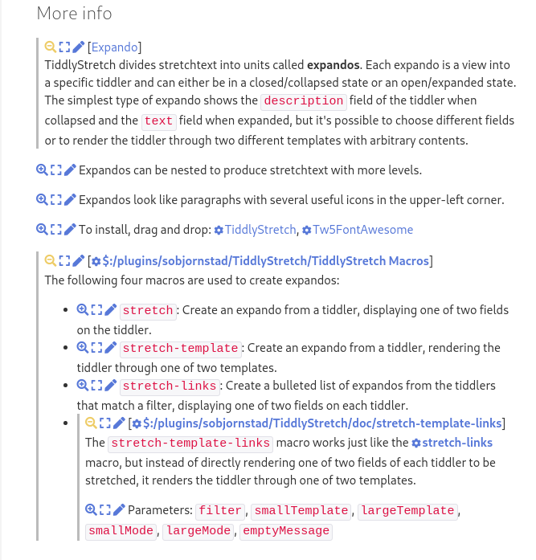

# TiddlyStretch

TiddlyStretch is a [TiddlyWiki][] plugin that allows you to write stretchtext,
    a form of hypertext where content can be expanded and contracted in place.

## Documentation

Installation and use instructions can be found at
https://sobjornstad.github.io/TiddlyStretch/.

You can find a few real examples of stretchtext in use
    [on my Zettelkasten](https://zettelkasten.sorenbjornstad.com/#:MyUnusualMentalExperience%20NegativeNumberDistress%20RecentlyRead).

## Building from source

Install the TiddlyWiki plugin in the `plugins/TiddlyStretch/` subdirectory
    directly to your Node.JS wiki
    (I like using [Peru][] to manage plugins)
    or build it into a TiddlyWiki plugin using the [dev instructions][]
    and then install it in your single-file wiki.
TiddlyWiki >=5.1.21 is required.

[TiddlyWiki]: https://tiddlywiki.com
[Peru]: https://github.com/buildinspace/peru
[dev instructions]: https://tiddlywiki.com/dev/#Developing%20plugins%20using%20Node.js%20and%20GitHub
